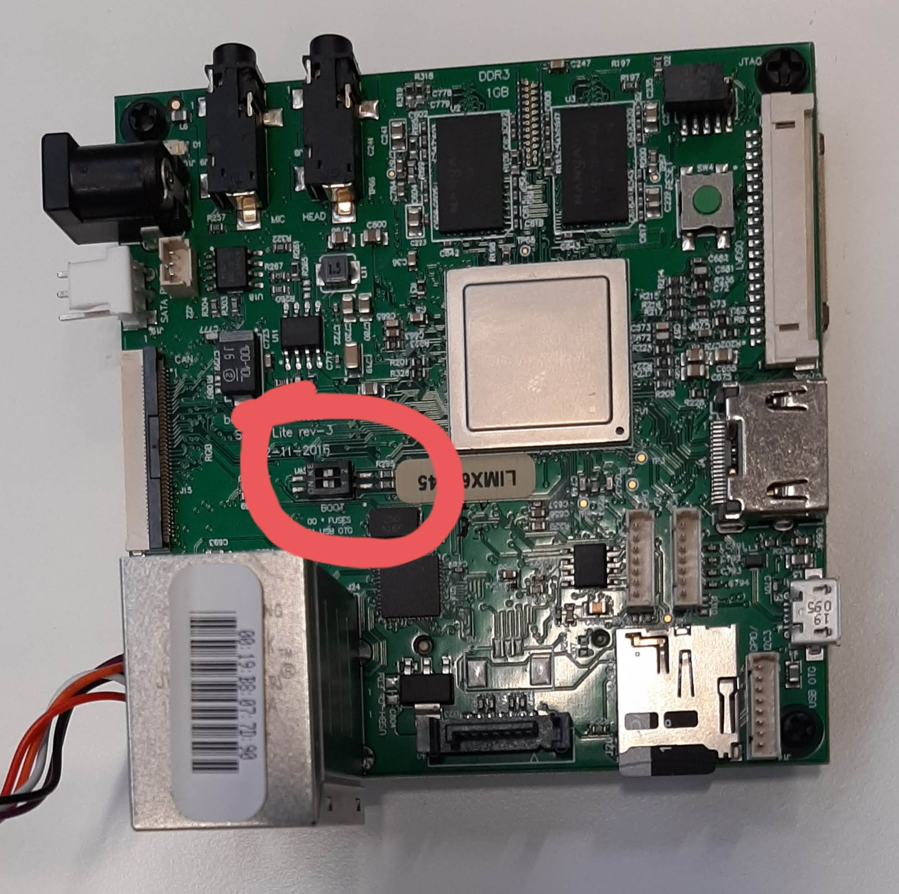
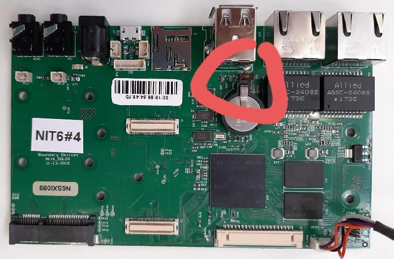

# Upgrading U-Boot on the Nitrogen SoloX and Sabre Lite boards

To upgrade or install U-Boot on the board, please refer to the following
instructions.

## Install U-Boot in the SPI flash

Below steps are based on <https://boundarydevices.com/how-to-upgrade-u-boot/>.

- Create the file `upgrade.scr` from `upgrade.scr.txt` using the `mkimage` tool
  from the u-boot-tools package:

```bash
mkimage -A arm -O linux -T script -C none -n "boot script" -a 0 -e 0 -d \
upgrade.scr.txt upgrade.scr
```

- Copy the file `upgrade.scr` to the SD card.
- Copy the `u-boot.imx` to the SD card.
- Interrupt the boot process by pressing enter when the console says "Hit any
  key to stop autoboot".

```bash
U-Boot 2018.07-36536-gb89e53e64c (Aug 31 2020 - 17:16:55 +0200)

CPU:   Freescale i.MX6SX rev1.3 at 792 MHz
Reset cause: WDOG
Board: nitrogen6sx
I2C:   ready
DRAM:  1 GiB
MMC:   FSL_SDHC: 0, FSL_SDHC: 1
Loading Environment from SPI Flash...
SF: Detected sst25vf016b with page size 256 Bytes, erase size 4 KiB, total 2 MiB
OK
Display: lvds:tm070jdhg30 (1280x800)
In:    serial
Out:   serial
Err:   serial
Net:   AR8035 at 4
AR8035 at 5
FEC0 [PRIME], FEC1, usb_ether
Hit any key to stop autoboot:  1
```

- Use the `run upgradeu` command (note `u` at the end!) to upgrade U-Boot in the
  internal SPI flash.
- On success you should see the following message:

```bash
=> run upgradeu
switch to partitions #0, OK
mmc0 is current device
Scanning mmc 0:1...
Found U-Boot script /upgrade.scr
4199 bytes read in 25 ms (163.1 KiB/s)
## Executing script at 80008000
Called gpio_direction_output() in mxc_gpio.c for gpio = 48 with value = 1.
SF: Detected sst25vf016b with page size 256 Bytes, erase size 4 KiB, total 2 MiB
probed SPI ROM
check U-Boot
490496 bytes read in 51 ms (9.2 MiB/s)
read 77c00 bytes from SD card
device 0 offset 0x400, size 0x77c00
SF: 490496 bytes @ 0x400 Read: OK
byte at 0x82000407 (0x17) != byte at 0x82400407 (0x87)
Total of 7 byte(s) were the same
Need U-Boot upgrade
Program in 5 seconds
5
4
3
2
1
erasing
SF: 786432 bytes @ 0x0 Erased: OK
programming
device 0 offset 0x800, size 0x77800
SF: 489472 bytes @ 0x800 Written: OK
device 0 offset 0x400, size 0x400
SF: 1024 bytes @ 0x400 Written: OK
verifying
device 0 offset 0x400, size 0x77c00
SF: 490496 bytes @ 0x400 Read: OK
Total of 490496 byte(s) were the same
---- U-Boot upgraded. reset
---- U-Boot upgraded. reset
---- U-Boot upgraded. reset
---- U-Boot upgraded. reset
---- U-Boot upgraded. reset
```

- You may now do the power on reset.
- New u-boot version shall now boot successfully, if something when wrong see
  the `USB Recovery` paragraph.

## USB Recovery

If something went wrong, you still can recover the board via USB recovery mode
(OTG port).

Below steps are based on <https://boundarydevices.com/recovering-i-mx-platforms-using-uuu/>.

- Force a boot to the USB recovery mode (OTG port) by settting the  DIP switch
  (SW1) to ON position <https://boundarydevices.com/unbricking-nitrogen6x-sabre-lite-i-mx6-board/>.

  
  

- Connect the micro-B USB cable, and power on the board.
- Check if device gets detected:

```bash
~$ lsusb | grep Free
Bus 001 Device 097: ID 15a2:0071 Freescale Semiconductor, Inc.
```

- Download the latest `uuu` binary from <https://github.com/NXPmicro/mfgtools/releases>.
- Run `uuu` with a desired u-boot image:

```bash
~$ sudo ./uuu u-boot.imx
[sudo] password for slakwa01:
uuu (Universal Update Utility) for nxp imx chips -- libuuu_1.4.43-0-ga9c099a
Success 1    Failure 0

1:21     2/ 2 [Done                                  ] SDP: done
```

- On success you should see on the u-boot console.

```bash
U-Boot 2018.07-36536-gb89e53e64c (Aug 31 2020 - 17:16:55 +0200)

CPU:   Freescale i.MX6SX rev1.3 at 792 MHz
Reset cause: WDOG
Board: nitrogen6sx
I2C:   ready
DRAM:  1 GiB
MMC:   FSL_SDHC: 0, FSL_SDHC: 1
Loading Environment from SPI Flash...
SF: Detected sst25vf016b with page size 256 Bytes, erase size 4 KiB, total 2 MiB
OK
Display: lvds:tm070jdhg30 (1280x800)
In:    serial
Out:   serial
Err:   serial
Net:   AR8035 at 4
AR8035 at 5
FEC0 [PRIME], FEC1, usb_ether
Hit any key to stop autoboot:  1
```

- Connect the SD card with the desired u-boot image and the update script.
- Run `upgrade.scr` as in the previous chapter.
