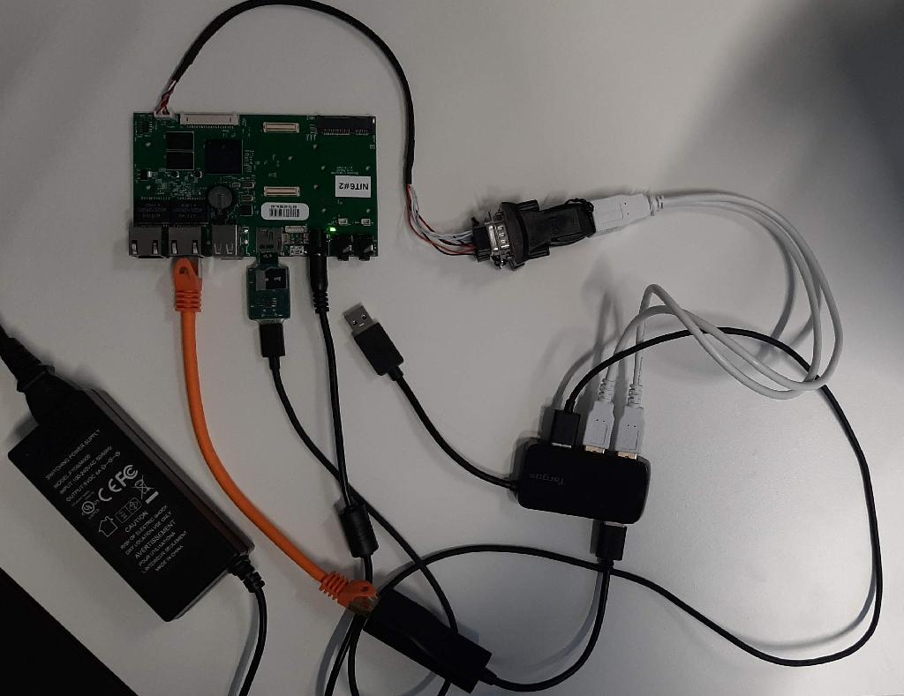
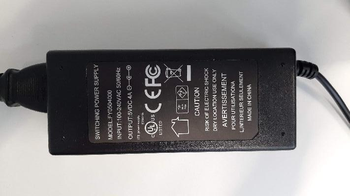
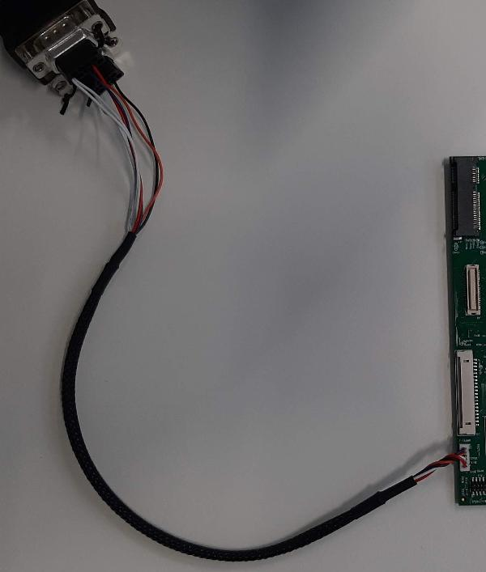
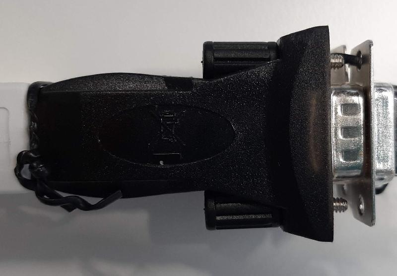
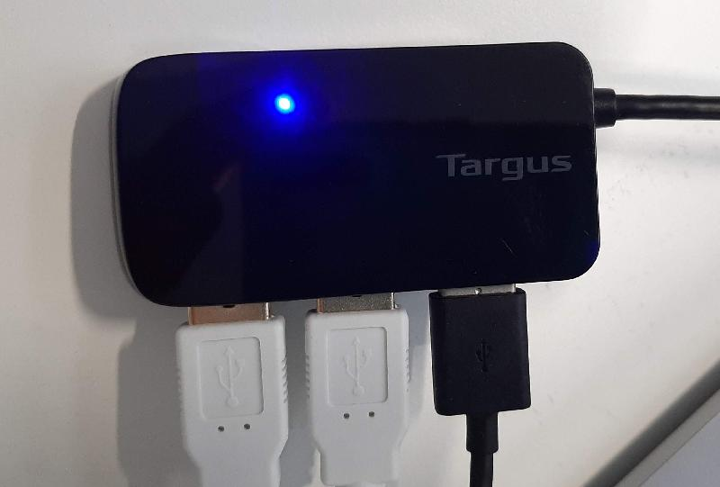
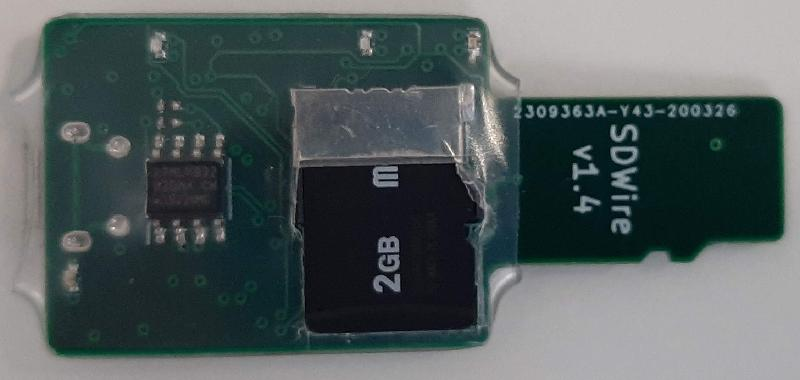
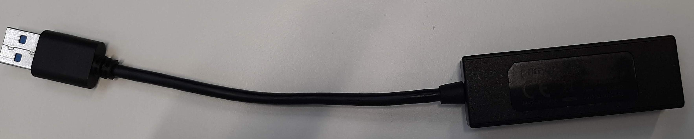
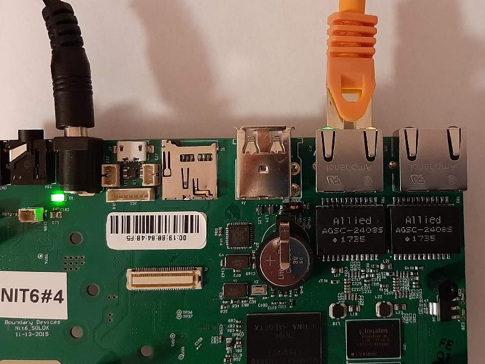
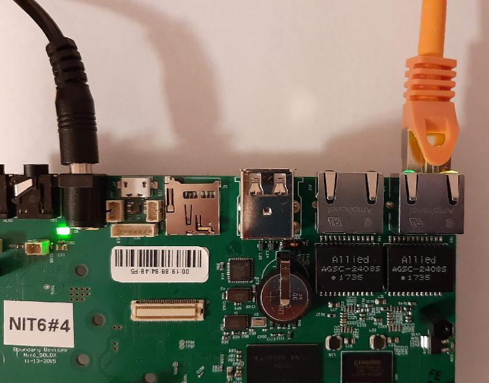

# Nitrogen Solo X Board Setup



## Required Components

The following components are required when using Nitrogen Solo X:

1. AC/DC Power supply (5V, min 1.5A, DC barrel connector 2.1mm x 5.5mm).
    
2. `RS-232` adapter.
    
3. RS232/USB adapter for accessing the console (note that it has a RS232
    connector and can deal with RS232 voltage levels and not the UART/USB
    adapter that supports TTL voltage levels).
    
4. SD Card.
5. Micro-B USB cable.
6. RJ45 Ethernet cable.

## Optional Components

The following components are optional but will make using the board much easier:

1. USB Hub.
    
2. `Tizen SDWire` for quick accessing the SD card both from the board and the
    PC.
    
3. USB Network adapter.
    

## Running and Testing U-Boot

Please refer to README.md on how to flash the U-Boot.

### Resetting Environment variable to default

If you make any mistake and would like to revert everything to the default state
firstly run `env default -a` command to reset all the environment variable for
the current session, and then `saveenv` for storing them in the persistent
storage.

### Testing Procedure

- Configure host PC network adapter IP to `10.0.0.1` as described here:
    <https://websiteforstudents.com/how-to-setup-static-fixed-ip-on-ubuntu-20-04-18-04/>
- Start your favorite terminal emulator e.g. `picocom` (note that current user
must be added to the `dialout` group):

```bash
picocom /dev/ttyUSB0 -b 115200
```

- Power up the board without an SD card and press any key to enter the u-boot
  console.

```bash
U-Boot 2018.07-36540-g240c0e5a66 (Nov 18 2020 - 16:02:01 +0100)

CPU:   Freescale i.MX6SX rev1.3 at 792 MHz
Reset cause: POR
Board: nitrogen6sx

I2C:   ready
DRAM:  1 GiB
MMC:   FSL_SDHC: 0, FSL_SDHC: 1
Loading Environment from SPI Flash...
SF: Detected sst25vf016b with page size 256 Bytes, erase size 4 KiB, total 2 MiB
OK
Display: lcd:1280x720M@60 (1280x720)
In:    serial
Out:   serial
Err:   serial
Net:   AR8035 at 4
AR8035 at 5
FEC0 [PRIME], FEC1, usb_ether
Hit any key to stop autoboot:  0
```

- Note the network settings:

```bash
Net:   AR8035 at 4
AR8035 at 5
```

- Dump the u-boot parameters and note them down:

```bash
=> printenv
arch=arm
baudrate=115200
board=nitrogen6sx
...
usb_boot=usb start; if usb dev ${devnum}; then setenv devtype usb; run scan_dev_for_boot_part; fi
usb_pgood_delay=2000
usbnet_devaddr=00:19:b8:00:00:02
usbnet_hostaddr=00:19:b8:00:00:01
usbnetwork=setenv ethact usb_ether; setenv ipaddr 10.0.0.2; setenv netmask 255.255.255.0; setenv serverip 10.0.0.1;
usbrecover=run usbnetwork;setenv bootargs console=${console},115200; tftpboot 80800000 10.0.0.1:uImage-${board}-recovery && tftpboot 82800000 10.0.0.1:uramdisk-${board}-recovery.img && bootm 80800000 82800000
vendor=boundary

Environment size: 5784/8188 bytes
```

#### Testing Ethernet Port #1

- Connected network adapter to the Ethernet Port #1.
    

- Set the following u-boot parameters:

```bash
setenv ethact FEC0
setenv ipaddr 10.0.0.2
```

- Check if host PC can be pinged:

```bash
=> ping 10.0.0.1
Using FEC0 device
host 10.0.0.1 is alive
```

#### Testing Ethernet Port #2

- Connected network adapter to the Ethernet Port #2.
    

- Set the following u-boot parameters:

```bash
setenv ethact FEC1
setenv ipaddr 10.0.0.2
```

- Check if host PC can be pinged:

```bash
=> ping 10.0.0.1
Using FEC1 device
host 10.0.0.1 is alive
```

## Setting up the SD card

The SD Card can be preformatted using parted, a partition table manipulator tool
for Linux that supports partitioning a storage device with a GPT.

To recreate the partition table layout the following commands need to be run
(make sure to replace `/path_to_device` with the correct path to the mounting
point of the SD Card):

```bash
parted --script </path_to_device> \
    mklabel gpt \
    mkpart primary fat16 1MiB 129MiB name 1 App1 \
    mkpart primary       129MiB 257MiB name 2 App2
```
